# Assets

Assets for dashboards and links.

## Recognition

I honestly don't remember where I downloaded those from. Back then I didn't want to get into the git thing. If I remember I will include a link to the source here.

Anyway, a big thank you for whoever made it available online.

## Trademark Legal Notices

All product names, trademarks and registered trademarks in the images in this repository, are property of their respective owners. All images in this repository are meant to be used for identification purposes and in personal dashboards & bookmarks (links).

The use of these names, trademarks and brands appearing in these image files, do not imply endorsement.

## Some of the images in this folder
    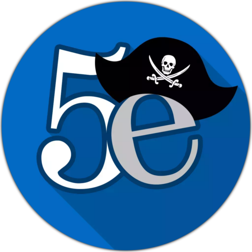                         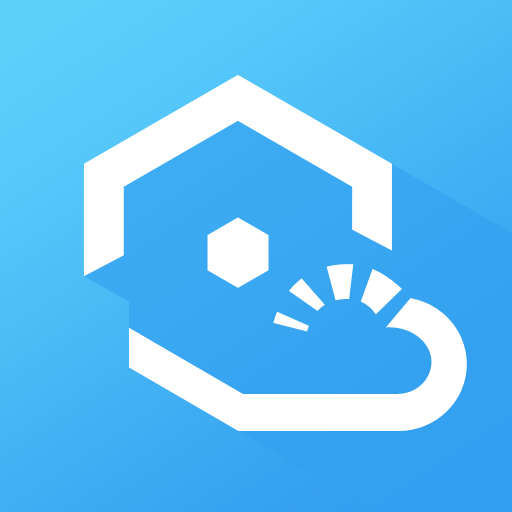                       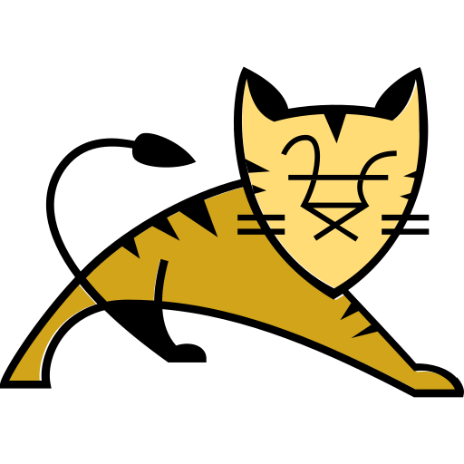        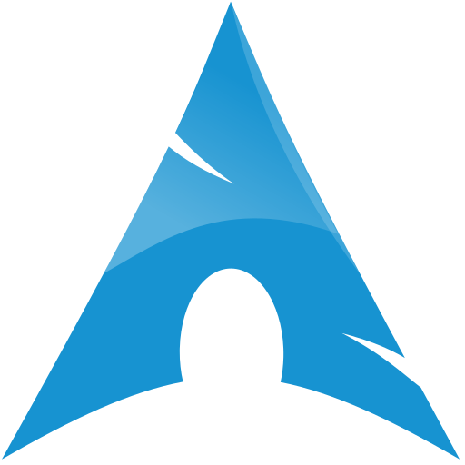          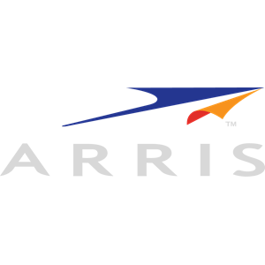                         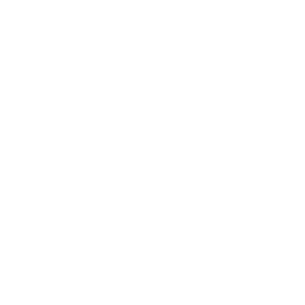         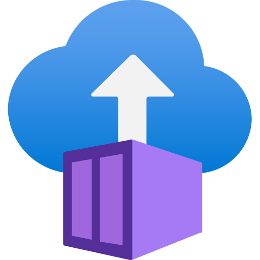 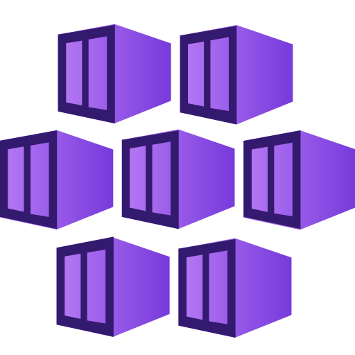            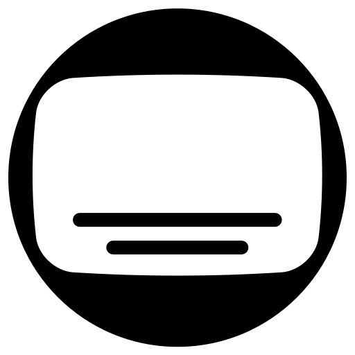                        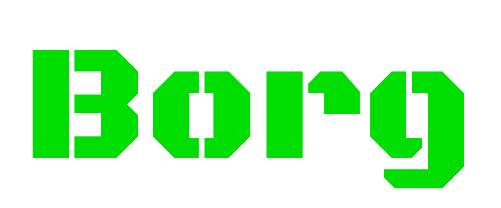  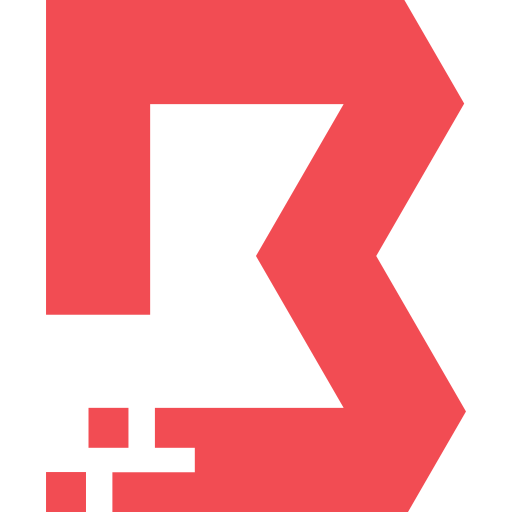                    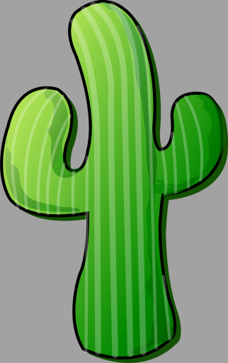               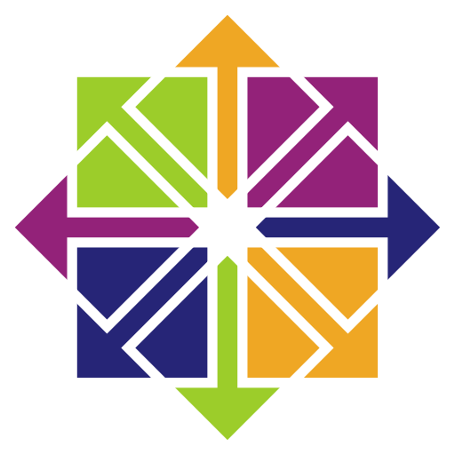                             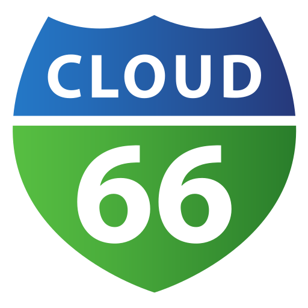                          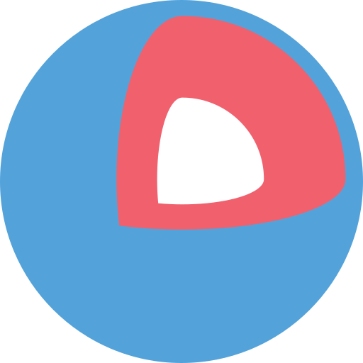                                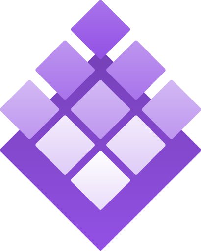 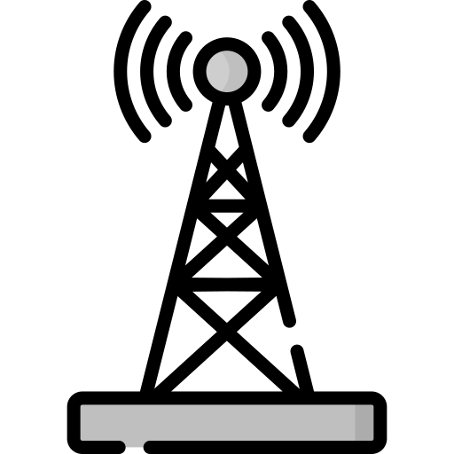  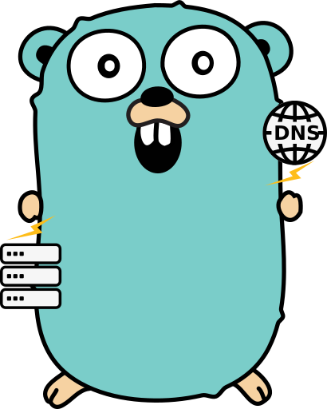            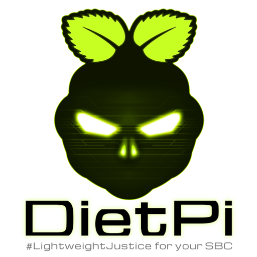 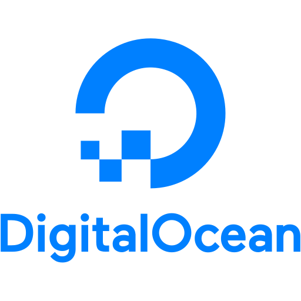                             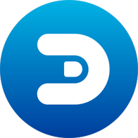          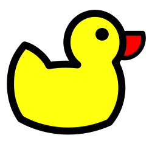         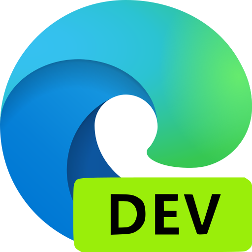        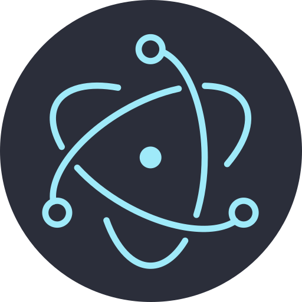      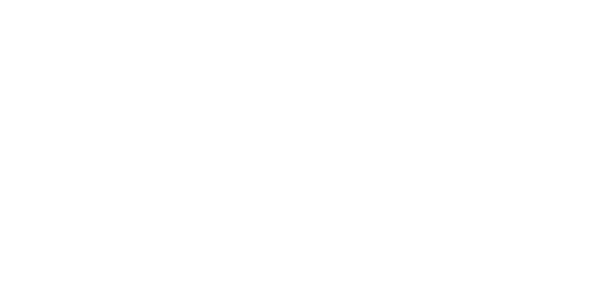                        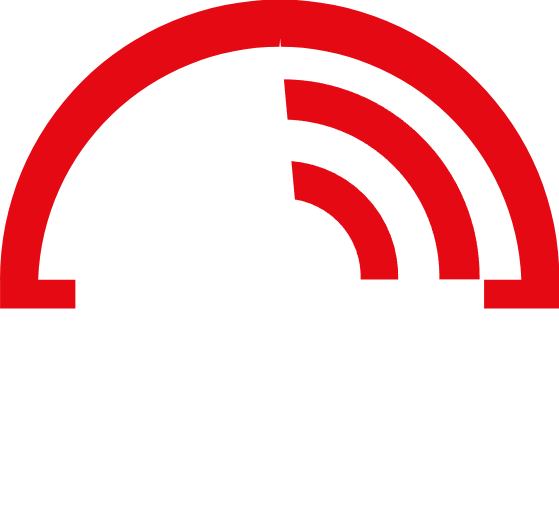              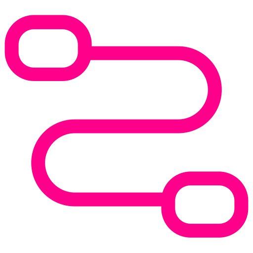               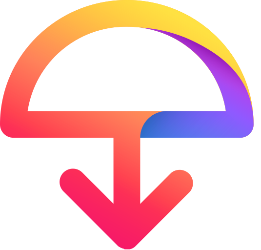            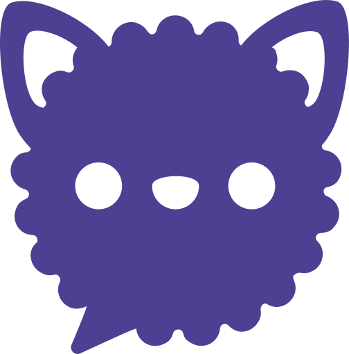               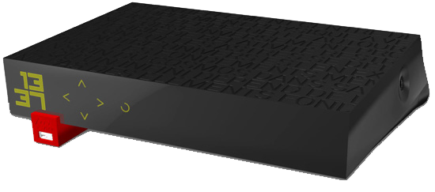         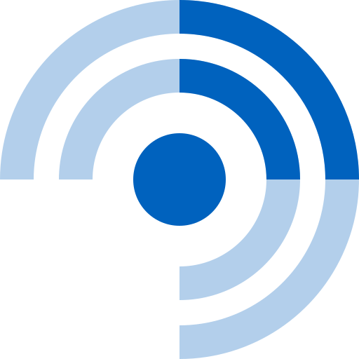     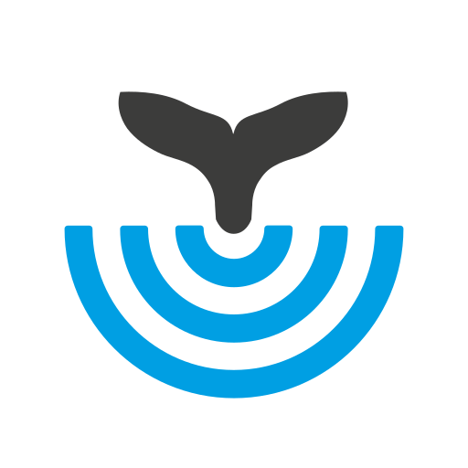     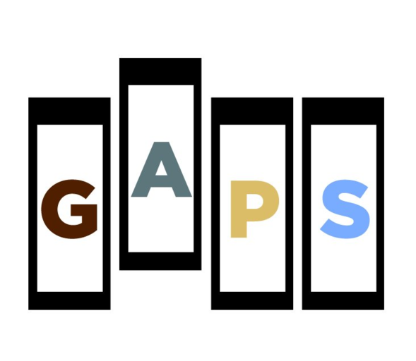                 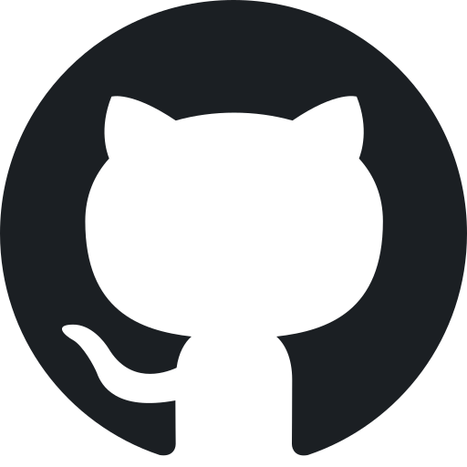           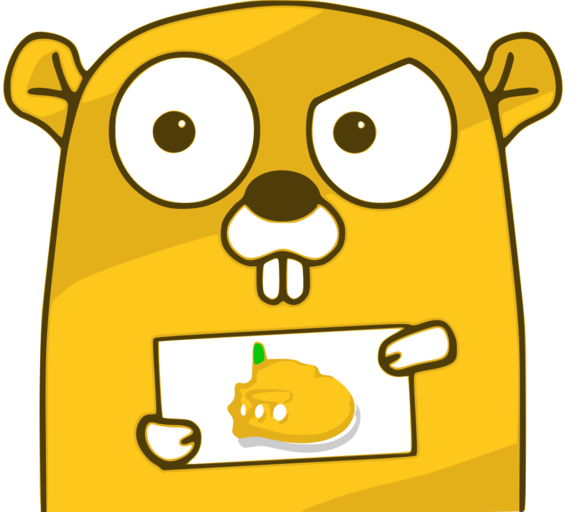             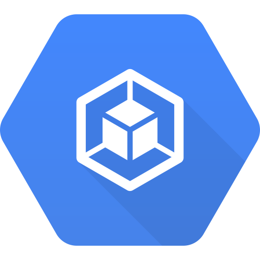                  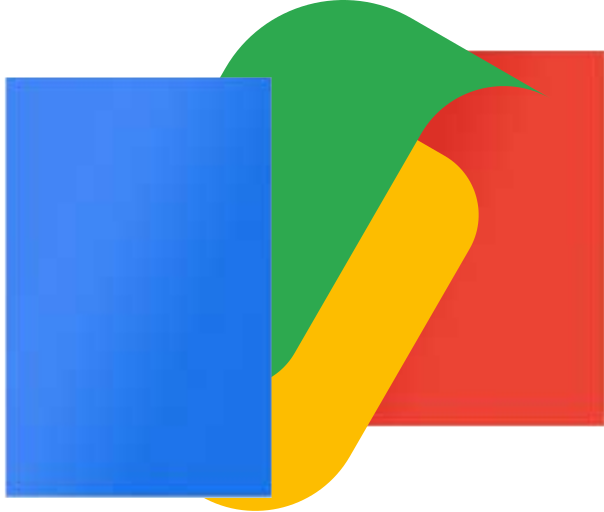     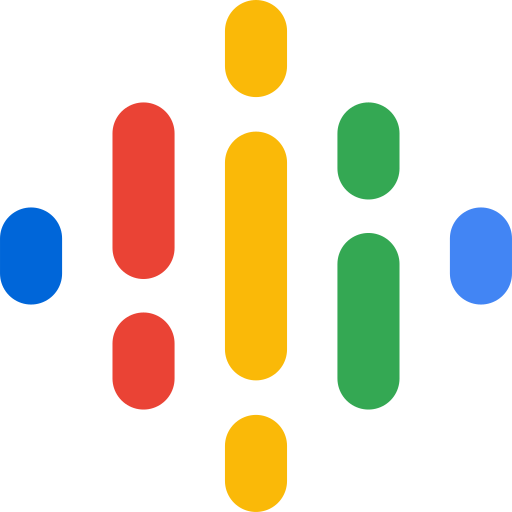               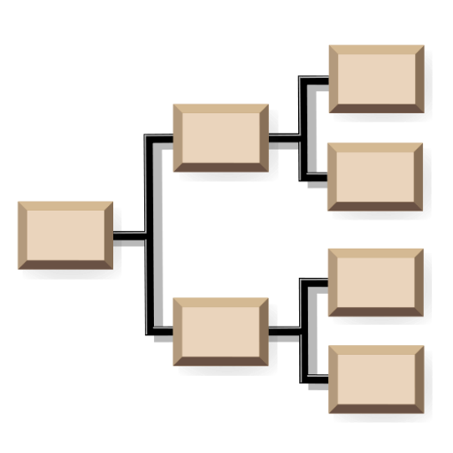  
